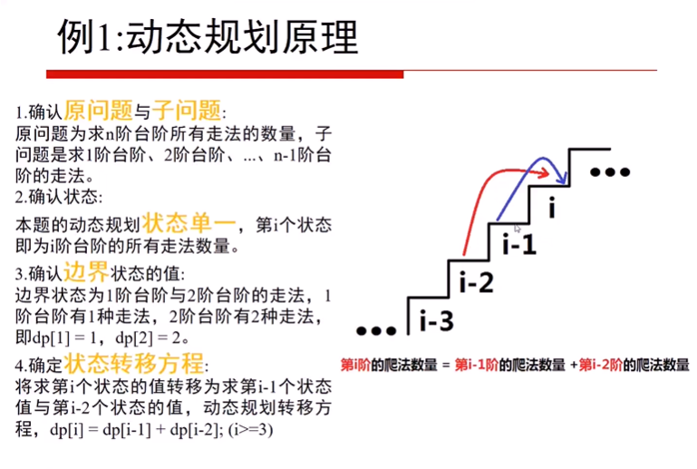
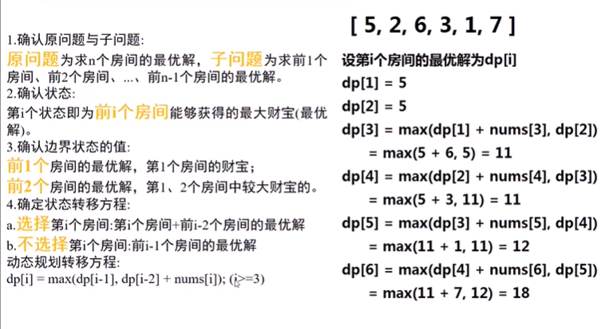
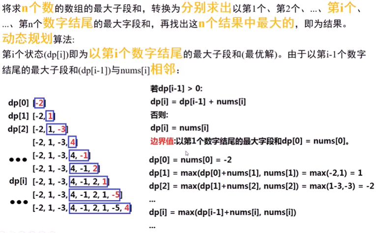
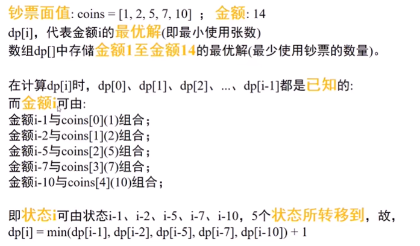
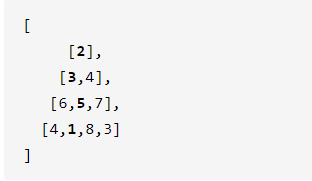
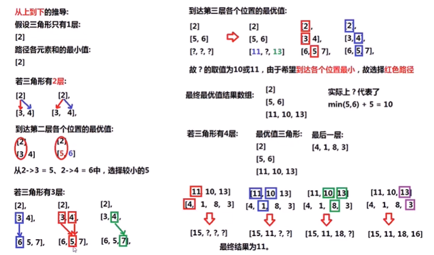
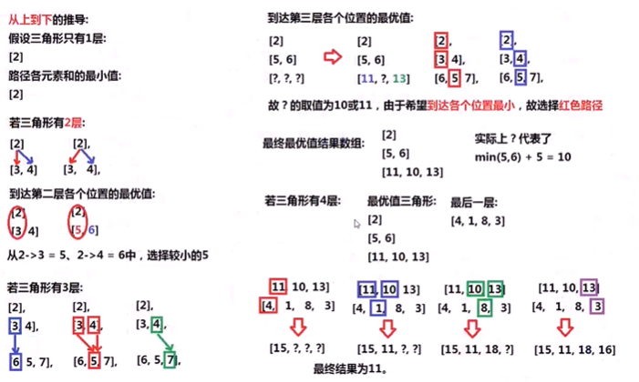
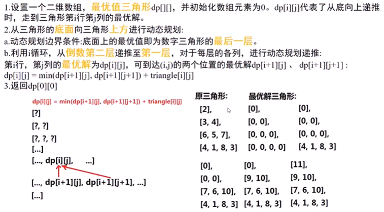
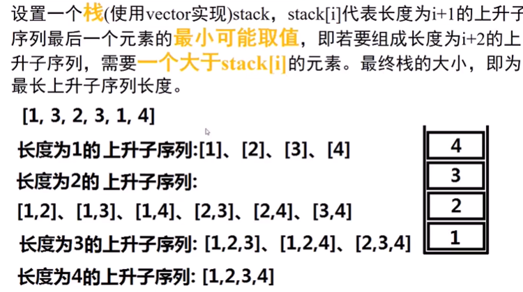

# 9 动态规划

## 例题 1

### 题目描述

假设你正在爬楼梯。需要 n 阶你才能到达楼顶。每次你可以爬 1 或 2 个台阶。你有多少种不同的方法可以爬到楼顶呢？注意：给定 n 是一个正整数。

### 示例

```shell
示例 1：
输入： 2
输出： 2
解释： 有两种方法可以爬到楼顶。
1.  1 阶 + 1 阶
2.  2 阶
示例 2：

输入： 3
输出： 3
解释： 有三种方法可以爬到楼顶。
1.  1 阶 + 1 阶 + 1 阶
2.  1 阶 + 2 阶
3.  2 阶 + 1 阶
```


链接：https://leetcode-cn.com/problems/climbing-stairs

### 分析




### code

```java
public class Solution {
    public int climbStairs(int n) {
        if (n <= 2)
            return n;
        int dp[] = new int[n+1];
        dp[1] = 1; // 达到第一节台阶只有1种走法
        dp[2] = 2; // 达到第二节台阶有2种走法
        for (int i = 3; i <= n; ++i) {
            // 到达地i个台阶的走法等于达到地 i-1个台阶的走法和到到第 i-2 个台阶的走法之和
            dp[i] = dp[i-1] + dp[i-2];
        }
        return dp[n]; // 到达第n节台阶走法
    }
}
```

## 例题 2

### 题目描述

你是一个专业的小偷，计划偷窃沿街的房屋。每间房内都藏有一定的现金，影响你偷窃的唯一制约因素就是相邻的房屋装有相互连通的防盗系统，如果两间相邻的房屋在同一晚上被小偷闯入，系统会自动报警。给定一个代表每个房屋存放金额的非负整数数组，计算你 不触动警报装置的情况下 ，一夜之内能够偷窃到的最高金额。

###  示例 

```shell
示例1
输入：[1,2,3,1]
输出：4
解释：偷窃 1 号房屋 (金额 = 1) ，然后偷窃 3 号房屋 (金额 = 3)。
     偷窃到的最高金额 = 1 + 3 = 4 。

示例 2：
输入：[2,7,9,3,1]
输出：12
解释：偷窃 1 号房屋 (金额 = 2), 偷窃 3 号房屋 (金额 = 9)，接着偷窃 5 号房屋 (金额 = 1)。
     偷窃到的最高金额 = 2 + 9 + 1 = 12 。
```

### 提示

0 <= nums.length <= 100
0 <= nums[i] <= 400

链接：https://leetcode-cn.com/problems/house-robber


### 分析



### Code

```java
public class Solution {
    public int rob(int[] nums) {
        int len = nums.length;
        if (len == 0) // 数组为空，收益为0
            return 0;
        if (len == 1) // 只有一个房间 收益就是这个房间内的财宝
            return nums[0];

        int dp[] = new int[len]; // 状态转移数组
        dp[0] = nums[0]; // 前一个房间可以获得的最大收益
        dp[1] = Math.max(nums[0],nums[1]); // 前两个房间获得的收益是第一/第二个房间内财宝的最大值
        for (int i = 2;i < len; ++i) {
            // 前 i 个房间能获得的最大收益 取决于盗不盗取第 i 个房间
            dp[i] = Math.max(dp[i-2] + nums[i],dp[i-1]);
        }
        return dp[len-1];
    }
}
```

## 例题3

### 题目描述

给定一个整数数组 nums ，找到一个具有最大和的连续子数组（子数组最少包含一个元素），返回其最大和。

### 示例

```shell
输入: [-2,1,-3,4,-1,2,1,-5,4]
输出: 6
解释: 连续子数组 [4,-1,2,1] 的和最大，为 6。
```

### 进阶

如果你已经实现复杂度为 O(n) 的解法，尝试使用更为精妙的分治法求解。
链接：https://leetcode-cn.com/problems/maximum-subarray

### 分析

关键就是子数组要以第 `i` 个元素结尾，那这样的话第 `i` 必须包含在子数组中了，那就要看前面的dp[i-1] 的符号了，如果是负数，则越加越小应该舍弃，正数越加越大则应保留。



### Code

```java
public class Solution {
    public int maxSubArray(int[] nums) {
        int len = nums.length;
        int dp[] = new int[len];
        dp[0] = nums[0]; // 只有一个元素，那最大子数组的和就是这个元素
        int maxSum = dp[0]; //
        for (int i = 1 ; i < len; ++i) {
            if (dp[i-1] <= 0) // 以 i-1 个元素结尾的子数组的最大和如小于等于 0 只会越加越小 应该舍弃 
                dp[i] = nums[i]; // 更新以第 i 个元素结尾的子数组的最大和
            else
                dp[i] = dp[i-1] + nums[i]; // 以 i-1 个元素结尾的子数组的最大和大于 0 只会越加越大 应该保留

            if (maxSum < dp[i]) { // 找 dp数组中的最大值
                maxSum = dp[i];
            }
        }
        return maxSum;
    }
}
```

## 例题 4

### 题目描述

给定不同面额的硬币 coins 和一个总金额 amount。编写一个函数来计算可以凑成总金额所需的最少的硬币个数。如果没有任何一种硬币组合能组成总金额，返回 -1。你可以认为每种硬币的数量是无限的。

### 示例

```shell
示例 1：
输入：coins = [1, 2, 5], amount = 11
输出：3 
解释：11 = 5 + 5 + 1

示例 2：
输入：coins = [2], amount = 3
输出：-1

示例 3：
输入：coins = [1], amount = 0
输出：0

示例 4：
输入：coins = [1], amount = 1
输出：1

示例 5：
输入：coins = [1], amount = 2
输出：2
```

### 提示

* 1 <= coins.length <= 12
* 1 <= coins[i] <= 2^31 - 1
* 0 <= amount <= 10^4

链接：https://leetcode-cn.com/problems/coin-change

### 分析



### Code

```java
public class Solution {
    public int coinChange(int[] coins, int amount) {
        int dp[] = new int[amount + 1];
        Arrays.fill(dp,-1);//将dp数组全部元素初始化为-1
        dp[0] = 0;
        for (int i = 1; i <= amount; ++i) {
           for (int j = 0; j < coins.length; ++j) {
               // 说明金额为 i 的硬币可以由coins[j]面值的硬币凑成
               if (i - coins[j] >= 0 && dp[i - coins[j]] != -1) {
                   // 更新凑成面值为 i 的金额需要的最少硬币数
                   if (dp[i] == -1 || dp[i] > dp[i - coins[j]] + 1)
                       dp[i] = dp[i - coins[j]] + 1;
               }
           }
       }
        return dp[amount];
    }
}
```

## 例题5

### 题目描述

给定一个三角形，找出自顶向下的最小路径和。每一步只能移动到下一行中相邻的结点上。相邻的结点 在这里指的是 下标 与 上一层结点下标 相同或者等于 上一层结点下标 + 1 的两个结点。

### 示例

例如，给定三角形：



自顶向下的最小路径和为 `11`（即，**2** + **3** + **5** + **1** = 11）

### 说明

如果你可以只使用 *O*(*n*) 的额外空间（*n* 为三角形的总行数）来解决这个问题，那么你的算法会很加分。

链接：https://leetcode-cn.com/problems/triangle

### 分析

本题的状态可以从上到下推导也可以从下往上推导

1. 从上往下推导

   初始转态就有点复杂，既要看左边的转态又要看右边的转态



2. 从下往上推导

只需要关注一种转态：当前元素的正下方和右下方转态即可，问题难度大大简化，便于编码，采用此种方式。





### Code

```java
public class Solution {
    public int minimumTotal(List<List<Integer>> triangle) {
        int n = triangle.size(); // 最后一行元素个数
        if (n == 0)
            return 0;

        int dp[][] = new int[n][n];
        // 将二维数组所有元素赋值为 0
        for (int i = 0; i < n; ++i)
            Arrays.fill(dp[i],0);

        // 初始化dp 数组最后一行
        for (int i = 0; i < n; i++) {
            // 将三角形最后一行复制给dp数组最后一行
            dp[n-1][i] = triangle.get(n-1).get(i);
        }

        // 从三角形倒数第二行开始遍历，填写dp 数组
        for (int i = n-2; i >= 0; i--) {
            for (int j = 0; j <= i; j++) {
                // 选择 较小的状态与当前值相加
                dp[i][j] = Math.min(dp[i+1][j],dp[i+1][j+1]) + triangle.get(i).get(j);
            }
        }
        return dp[0][0];//dp[0][0]就是最优解
    }
}
```

## 例题 6

### 题目描述

给定一个无序的整数数组，找到其中最长上升子序列的长度。

### 示例

```shell
输入: [10,9,2,5,3,7,101,18]
输出: 4 
解释: 最长的上升子序列是 [2,3,7,101]，它的长度是 4。
```

### 说明

* 可能会有多种最长上升子序列的组合，你只需要输出对应的长度即可。
* 你算法的时间复杂度应该为 O(n2) 。

**进阶: 你能将算法的时间复杂度降低到 O(n log n) 吗?**

链接：https://leetcode-cn.com/problems/longest-increasing-subsequence

### 分析 1

定义 `dp[i]` 为以第 `i`个数字结尾的最长上升子序列的长度，注意`nums[i]`必须被选取。我们从小到大计算`dp[]`数组的值，在计算 `dp[i]` 之前，我们已经计算出 `dp[0...i-1]` 的值，则状态转移方程为：

​				`dp[i] = max(dp[j]) + 1` ，其中 `0 <= j < i` 且 `nums[j] < num[i]`

即考虑往`dp[0...i-1]` 中最长的上升子序列后面再加一个`nums[i]`。由于`dp[j]` 代表`nums[0...j]`中以 `nums[j]` 结尾的最长上升子序列，所以如果能从`dp[j]`这个状态转移过来，那么`nums[i]` 必然要大于 `nums[j]`，才能将`nums[i]`放在`nums[j]` 后面以形成更长的上升子序列。

### Code 1

```java
public class Solution {
    public int lengthOfLIS(int[] nums) {
        int n = nums.length;
        if (n == 0)
            return 0;

        int dp[] = new int[n];

        dp[0] = 1;// 初始转态
        int lis = 1;// 最长上升子序列 只要数组不为空，最长上升子序列至少是 1
        for (int i = 1; i < n; ++i) {
            dp[i]  = 1;// 一开始认为新遍历到的元素独立成一个子序列
            for (int j = 0; j < i; ++j) {
                if (nums[i] > nums[j]){
                    dp[i] = Math.max(dp[i],dp[j] + 1);
                }
            }
            // 在dp数组中找一个最大值
            lis = Math.max(lis,dp[i]);
        }
        return lis;
    }
}
```

### 分析 2



### Code 2

