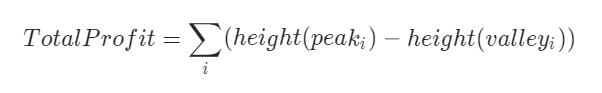

# 数组 121 /122/309

## 题目描述

给定一个数组，它的第 i 个元素是一支给定股票第 i 天的价格。如果你最多只允许完成一笔交易（即买入和卖出一支股票一次），设计一个算法来计算你所能获取的最大利润。注意：你不能在买入股票前卖出股票。

## 示例

```java
示例 1:
输入: [7,1,5,3,6,4]
输出: 5
解释: 在第 2 天（股票价格 = 1）的时候买入，在第 5 天（股票价格 = 6）的时候卖出，最大利润 = 6-1 = 5 。
     注意利润不能是 7-1 = 6, 因为卖出价格需要大于买入价格；同时，你不能在买入前卖出股票。
    
示例 2:
输入: [7,6,4,3,1]
输出: 0
解释: 在这种情况下, 没有交易完成, 所以最大利润为 0。
```


链接：https://leetcode-cn.com/problems/best-time-to-buy-and-sell-stock

## 解析

我们只要用一个变量记录一个历史最低价格 minprice，我们就可以假设自己的股票是在那天买的。那么我们在第 i 天卖出股票能得到的利润就是 prices[i] - minprice。因此，我们只需要遍历价格数组一遍，记录历史最低点，然后在每一天考虑这么一个问题：如果我是在历史最低点买进的，那么我今天卖出能赚多少钱？当考虑完所有天数之时，我们就得到了最好的答案。

## code

```java
class Solution {
    public int maxProfit(int[] prices) {
        int minPrice = Integer.MAX_VALUE;// 历史最近价
        int maxProfit = 0;// 最大利润
        for(int i = 0; i < prices.length; ++i) {
            if (prices[i] < minPrice){
                // 第i天是历史最低价则买入
                minPrice = prices[i];
            } else if(maxProfit < prices[i] - minPrice){
                // 第i天不买入 判断这天卖出能否得到最大利润
                maxProfit = prices[i] - minPrice;
            }
        }
        return maxProfit;
    }
}
```

## 题目描述

给定一个数组，它的第 i 个元素是一支给定股票第 i 天的价格。设计一个算法来计算你所能获取的最大利润。你可以尽可能地完成更多的交易（多次买卖一支股票）。注意：你不能同时参与多笔交易（你必须在再次购买前出售掉之前的股票）。

链接：https://leetcode-cn.com/problems/best-time-to-buy-and-sell-stock-ii/

## 示例

```shell
示例 1:
输入: [7,1,5,3,6,4]
输出: 7
解释: 在第 2 天（股票价格 = 1）的时候买入，在第 3 天（股票价格 = 5）的时候卖出, 这笔交易所能获得利润 = 5-1 = 4 。
     随后，在第 4 天（股票价格 = 3）的时候买入，在第 5 天（股票价格 = 6）的时候卖出, 这笔交易所能获得利润 = 6-3 = 3 。

示例 2:
输入: [1,2,3,4,5]
输出: 4
解释: 在第 1 天（股票价格 = 1）的时候买入，在第 5 天 （股票价格 = 5）的时候卖出, 这笔交易所能获得利润 = 5-1 = 4 。
     注意你不能在第 1 天和第 2 天接连购买股票，之后再将它们卖出。
     因为这样属于同时参与了多笔交易，你必须在再次购买前出售掉之前的股票。

示例 3:
输入: [7,6,4,3,1]
输出: 0
解释: 在这种情况下, 没有交易完成, 所以最大利润为 0。
```

## 提示

- `1 <= prices.length <= 3 * 10 ^ 4`
- `0 <= prices[i] <= 10 ^ 4`

## 解析

假设给定的数组为：[7, 1, 5, 3, 6, 4] 如果我们在图表上绘制给定数组中的数字，我们将会得到：


如果我们分析图表，那么我们的兴趣点是连续的峰和谷。用数学语言描述为：




关键是我们需要考虑到紧跟谷的每一个峰值以最大化利润。如果我们试图跳过其中一个峰值来获取更多利润，那么我们最终将失去其中一笔交易中获得的利润，从而导致总利润的降低。也就是说我们需要找一对波谷与波峰，在波谷的时候买入并在波峰的时候卖出，以此类推就可以获得最大利润。

## code

```java
public class Solution {
    public int maxProfit(int[] prices) {
        int maxProfit = 0;// 最大利润
        int valley = 0; // 波谷值 此时买入
        int peak = 0; // 波峰值 此时卖出
        int index = 0; // 索引
        // 这里必须是 index < prices.length - 1 因为波谷、波峰要成对出现
        while (index < prices.length - 1) {
            // 找波谷
            while (index < prices.length - 1 && prices[index] >= prices[index+1]) // 必须是大于等于，否则会死循环，如[3,3]
                index++;
            valley = prices[index];
            // 找波峰
            while (index < prices.length - 1 && prices[index] <= prices[index+1]) // 必须是小于等于，否则会死循环，如[3,3]
                index++;
            peak = prices[index];
            // 计算此时最大利润
            maxProfit += (peak - valley);
        }
        return maxProfit;
    }
}
```

## 题目描述

给定一个整数数组，其中第 i 个元素代表了第 i 天的股票价格 。设计一个算法计算出最大利润。在满足以下约束条件下，你可以尽可能地完成更多的交易（多次买卖一支股票）：

* 你不能同时参与多笔交易（你必须在再次购买前出售掉之前的股票）。
* 卖出股票后，你无法在第二天买入股票 (即冷冻期为 1 天)。

链接：https://leetcode-cn.com/problems/best-time-to-buy-and-sell-stock-with-cooldown/

## 示例

```shell
输入: [1,2,3,0,2]
输出: 3 
解释: 对应的交易状态为: [买入, 卖出, 冷冻期, 买入, 卖出]
```

## 解析

一种常用的方法是将「买入」和「卖出」分开进行考虑：「买入」为负收益，而「卖出」为正收益。在初入股市时，你只有「买入」的权利，只能获得负收益。而当你「买入」之后，你就有了「卖出」的权利，可以获得正收益。显然，我们需要尽可能地降低负收益而提高正收益，因此我们的目标总是将收益值最大化。因此，我们可以使用动态规划的方法，维护在股市中每一天结束后可以获得的「累计最大收益」，并以此进行状态转移，得到最终的答案。

我们用 f[i] 表示第 i 天结束之后的「累计最大收益」。根据题目描述，由于我们最多只能同时买入（持有）一支股票，并且卖出股票后有冷冻期的限制，因此我们会有三种不同的状态：

* 我们目前持有一支股票，对应的「累计最大收益」记为 `f[i][0]`；

* 我们目前不持有任何股票，并且处于冷冻期中，对应的「累计最大收益」记为 `f[i][1]`；

* 我们目前不持有任何股票，并且不处于冷冻期中，对应的「累计最大收益」记为 `f[i][2]`。

**这里的「处于冷冻期」指的是在第 i 天结束之后的状态。也就是说：如果第 i 天结束之后处于冷冻期，那么第 i+1 天无法买入股票**

如何进行状态转移呢？在第 i 天时，我们可以在不违反规则的前提下进行「买入」或者「卖出」操作，此时第 i 天的状态会从第 `i-1` 天的状态转移而来；我们也可以不进行任何操作，此时第 `i` 天的状态就等同于第 `i-1` 天的状态。那么我们分别对这三种状态进行分析：

* 对于 `f[i][0]`，我们目前持有的这一支股票可以是在第 `i-1` 天就已经持有的，对应的状态为 `f[i-1][0]`；或者是第 `i`天买入的，那么第`i-1` 天就不能持有股票并且不处于冷冻期中，对应的状态为`f[i-1][2]` 加上买入股票的负收益 `prices[i]`。因此状态转移方程为：

  ​	`f[i][0] = max(f[i-1][0],f[i-1][2] - prices[i])`

* 对于`f[i][1]`，我们在第 `i` 天结束之后处于冷冻期的原因是在当天卖出了股票，那么说明在第 `i-1` 天时我们必须持有一支股票，对应的状态为`f[i-1][0]` 加上卖出股票的正收益 `prices[i]`。因此状态转移方程为：

  ​	`f[i][1] = f[i-1][0] + prices[i]`

* 对于`f[i][2]`，我们在第`i`天结束之后不持有任何股票并且不处于冷冻期，说明当天没有进行任何操作，即第`i-1`天时不持有任何股票：如果处于冷冻期，对应的状态为`f[i-1][1]`；如果不处于冷冻期，对应的状态为`f[i-1][2]`。因此状态转移方程为：

  ​	`f[i][2] =  max(f[i-1][1],f[i-1][2])`

这样我们就得到了所有的状态转移方程。如果一共有 `n` 天，那么最终的答案即为：

​		`max(f[n-1][0],f[n-1][1],f[n-1][2])`

注意到如果在最后一天（第 `n-1` 天）结束之后，手上仍然持有股票，那么显然是没有任何意义的。因此更加精确地，最终的答案实际上是 

​	`max(f[n-1][1],f[n-1][2])`

## code

```java
class Solution {
    public int maxProfit(int[] prices) {
        if (prices.length == 0)
            return 0;
        int f0 = -prices[0];// 初始时收益为负
        int f1 = 0;
        int f2 = 0;
        for (int i = 0; i < prices.length; i++){
            int newf0 = Math.max(f0,f2 - prices[i]); // 代表第i天持股
            int newf1 = f0 + prices[i]; // 代表第i天不持股，处于冷冻期
            int newf2 = Math.max(f2,f1); // 代表第i天不持股，处于非冷冻期
            // 更新收益
            f0 = newf0;
            f1 = newf1;
            f2 = newf2;
        }
        return Math.max(f1,f2);
    }
}
```

