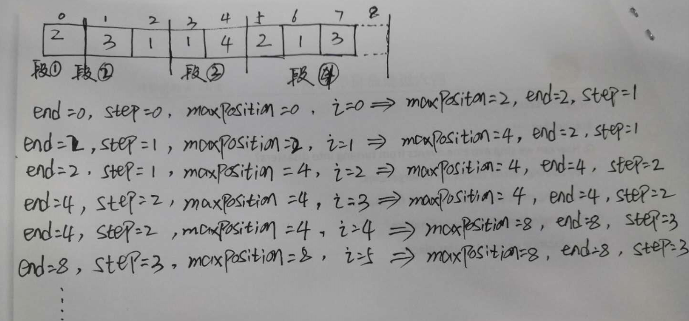

# 数组55/45   贪心算法

## 题目描述

给定一个非负整数数组，你最初位于数组的第一个位置。数组中的每个元素代表你在该位置可以跳跃的最大长度。判断你是否能够到达最后一个位置。

## 示例

示例 1：

```shell
输入: [2,3,1,1,4]
输出: true
解释: 我们可以先跳 1 步，从位置 0 到达 位置 1, 然后再从位置 1 跳 3 步到达最后一个位置。
```

示例 2：

```shell
输入: [3,2,1,0,4]
输出: false
解释: 无论怎样，你总会到达索引为 3 的位置。但该位置的最大跳跃长度是 0 ， 所以你永远不可能到达最后一个位置。
```

链接：https://leetcode-cn.com/problems/jump-game

## 解析

我们可以用贪心的方法解决这个问题。设想一下，对于数组中的任意一个位置 y，我们如何判断它是否可以到达？根据题目的描述，只要存在一个位置 x，它本身可以到达，并且它跳跃的最大长度为 x +nums[x]，且x +nums[x] >= y，那么位置 y也可以到达。换句话说，对于每一个可以到达的位置 x，它使得 x+1, x+2, ..., x+nums[x] 这些连续的位置都可以到达。这样一来，我们依次遍历数组中的每一个位置，并实时维护 最远可以到达的位置。对于当前遍历到的位置 x，如果它在最远可以到达的位置的范围内，那么我们就可以从起点通过若干次跳跃到达该位置，因此我们可以用 x+nums[x]更新 最远可以到达的位置。

在遍历的过程中，如果 最远可以到达的位置 大于等于数组中的最后一个位置，那就说明最后一个位置可达，我们就可以直接返回 True 作为答案。反之，如果在遍历结束后，最后一个位置仍然不可达，我们就返回 False 作为答案。

## Code

```java
class Solution {
    public boolean canJump(int[] nums) {
        int len = nums.length;
        // 数组长度低于2 必然可以到达最后一个位置
        if (len <= 1)
            return true;
        //最远能达到的长度
        int rightMost = 0;
        for (int i = 0; i < len;i++) {
            if (i <= rightMost){
                // 更新最远能到达的长度
                rightMost = Math.max(rightMost,i+nums[i]);
            }
            // 最远能到达的长度大于等于最大索引必然可以达到最后一个位置
            if (rightMost >= len-1)
                return true;
        }
        return false;
    }
}
```

## 题目描述

给定一个非负整数数组，你最初位于数组的第一个位置。数组中的每个元素代表你在该位置可以跳跃的最大长度。你的目标是使用最少的跳跃次数到达数组的最后一个位置。

## 示例

示例1

```shell
输入: [2,3,1,1,4]
输出: 2
解释: 跳到最后一个位置的最小跳跃数是 2。从下标为 0 跳到下标为 1 的位置，跳 1 步，然后跳 3 步到达数组的最后一个位置。
```

**说明  ：假设你总是可以到达数组的最后一个位置**

链接：https://leetcode-cn.com/problems/jump-game-ii

## 解析

这个问题和上面的问题一样都可以用贪心策略解决，我们可以贪心地进行正向查找，用当前能到达的最远位置作为分段依据，每个段的右边界就是当前段的最远达到位置，当遍历到当前段的右边界时，更新右边界，步数加1，也就是说每一段必须跳一步。以此类推，直到遍历完整个数组。结合下面的示例理解：



## code

```java
class Solution {
    public int jump(int[] nums) {
        int end = 0; // 每一段的右边界
        int maxPosition = 0; //每一段最远能到的位置
        int step = 0; // 当前步数
        int len = nums.length;
        for (int i = 0; i < len -1; ++i){
            maxPosition = Math.max(maxPosition,i + nums[i]);// 更新最远能到的位置
            if (i == end){
                end = maxPosition;// 到达当前段的右边界，更新为下一段的右边界
                step++;//每一段必须跳一步
            }
        }
        return step;
    }
}
```

